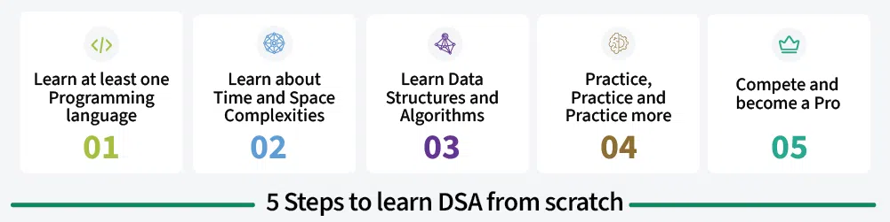

# Introduction to Data Structures and Algorithms.

**DSA (Data Structures and Algorithms)** is the study of organizing data efficiently using data structures like arrays, stacks, and trees, paired with step-by-step procedures (or algorithms) to solve problems effectively. Data structures manage how data is stored and accessed, while algorithms focus on processing this data.

### Why to Learn DSA?
    -   Learning DSA boosts your problem-solving abilities and make you a stronger programmer.
    -   DSA is foundation for almost every software like GPS, Search Engines, AI ChatBots, Gaming Apps, Databases, Web Applications, etc

### How to Learn DSA?


---

### Time Complexity


| **Time Complexity** | **Example**                        | **Growth Rate**          |
|----------------------|------------------------------------|--------------------------|
| `O(1)`              | Accessing an array element        | Constant                |
| `O(log n)`          | Binary search                     | Very slow               |
| `O(n)`              | Traversing a list                 | Moderate                |
| `O(n log n)`        | Merge Sort                        | Faster than `O(n^2)`    |
| `O(n^2)`            | Nested loops                      | Slow                    |
| `O(n^3)`            | Matrix multiplication             | Very slow               |
| `O(2^n)`            | Recursive Fibonacci               | Extremely slow          |
| `O(n!)`             | Generating permutations           | Impractical             |


### **Why Asymptotic Notations Are Used**

Asymptotic notations provide a mathematical framework to analyze and describe the efficiency of algorithms, especially for large inputs. They focus on the growth rate of an algorithm's runtime or space requirements relative to the input size, ignoring constant factors and lower-order terms. 

This allows us to:
1. **Abstract Details**: Focus on the overall behavior of an algorithm without worrying about hardware or implementation specifics.
2. **Compare Algorithms**: Provide a common language to evaluate which algorithm is more efficient for a given problem.
3. **Predict Scalability**: Understand how algorithms perform as the input size grows arbitrarily large.

### **Are They Like Units?**

No, asymptotic notations are not units like meters or seconds. Instead, they are expressions representing growth rates or upper/lower bounds of an algorithm's performance. Think of them as **qualitative descriptors** rather than quantitative measures.

For example:
- \( O(n) \): Linear growth.
- \( O(n^2) \): Quadratic growth.
- \( O(1) \): Constant growth.

These notations do not give precise timings (like 5 seconds or 10 milliseconds) but rather describe the **rate at which the algorithm slows down or speeds up** as \( n \) grows.

---

### **Example: Why Time Complexity Matters**

**Case**: Sorting 1 million integers.
- **Algorithm 1**: Bubble Sort (\( O(n^2) \))  
  Time = \( 1{,}000{,}000^2 = 1{,}000{,}000{,}000{,}000 \) operations (impractical for large \( n \)).

- **Algorithm 2**: Merge Sort (\( O(n \log n) \))  
  Time = \( 1{,}000{,}000 \cdot \log(1{,}000{,}000) = 20{,}000{,}000 \) operations (much faster).


---

### **Core Idea Behind Asymptotic Notations**

The key idea is to focus on the dominant factor that influences the runtime or space complexity as input size grows large. 

- Small inputs might not show noticeable differences between algorithms.
- For large inputs, the growth rate becomes critical to determine efficiency.

Asymptotic analysis disregards:
- **Constants**: Since they don’t impact the growth rate.
  - Example: \( 2n \) and \( 100n \) both grow linearly.
- **Lower-order Terms**: Since they become negligible for large \( n \).
  - Example: \( n^2 + n \approx n^2 \) for large \( n \).

---

### **Types of Asymptotic Notations (With Examples)**

#### **1. Big-O Notation (\( O \)) – Upper Bound**
Represents the worst-case growth rate, giving an upper limit.

- **Example**: Linear Search
  ```python
  def linear_search(arr, target):
      for i in range(len(arr)):
          if arr[i] == target:
              return i
      return -1
  ```
  **Time Complexity**: \( O(n) \)  
  - In the worst case, the algorithm examines all \( n \) elements.

---

#### **2. Omega Notation (\( \Omega \)) – Lower Bound**
Represents the best-case growth rate, giving a lower limit.

- **Example**: Binary Search
  ```python
  def binary_search(arr, target):
      low, high = 0, len(arr) - 1
      while low <= high:
          mid = (low + high) // 2
          if arr[mid] == target:
              return mid
          elif arr[mid] < target:
              low = mid + 1
          else:
              high = mid - 1
      return -1
  ```
  **Time Complexity**: 
  - Best case: \( \Omega(1) \), if the target is at the middle on the first comparison.

---

#### **3. Theta Notation (\( \Theta \)) – Tight Bound**
Represents both upper and lower bounds, describing the average-case growth rate.

- **Example**: Merge Sort
  ```python
  def merge_sort(arr):
      if len(arr) > 1:
          mid = len(arr) // 2
          left = arr[:mid]
          right = arr[mid:]
          merge_sort(left)
          merge_sort(right)
          merge(left, right)
  ```
  **Time Complexity**: \( \Theta(n \log n) \)  
  - Always requires \( n \log n \) operations for dividing and merging.

---

### **Why Ignore Constants and Lower-order Terms?**

- **Constants**: Dependent on machine speed, compiler optimizations, or implementation details, which are not relevant to algorithm scalability.
  - Example: Sorting \( 1{,}000{,}000 \) numbers:
    - Algorithm A: \( 2n \) operations → \( 2 \cdot 1{,}000{,}000 = 2{,}000{,}000 \)
    - Algorithm B: \( 100n \) operations → \( 100 \cdot 1{,}000{,}000 = 100{,}000{,}000 \)
    - Both are \( O(n) \), but Algorithm A is faster in practice.

- **Lower-order Terms**: Become negligible as \( n \) grows.
  - Example: \( n^2 + n \approx n^2 \) for large \( n \).

---

### **Real-world Analogy**

Consider traveling by car from one city to another:
- **Big-O (\( O \))**: Worst-case time to reach your destination (e.g., if there's heavy traffic).
- **Omega (\( \Omega \))**: Best-case time (e.g., if there’s no traffic).
- **Theta (\( \Theta \))**: Average-case time (e.g., under typical traffic conditions).

If someone asks, "How long will it take?" you're more concerned about the worst-case time rather than exact minute-by-minute delays.

---

### **Conclusion**

Asymptotic notations abstract away implementation details and allow us to focus on how an algorithm scales. They provide a **universal framework** to compare algorithms and choose the best one for handling large data efficiently.


---
---
### **Techniques to Find Time Complexity**

There are several techniques to determine the time complexity of an algorithm. Each technique focuses on specific aspects of the code structure or problem-solving approach.

---

### **1. Counting Basic Operations**

#### **Description**:
- Count the number of basic operations (e.g., comparisons, additions, multiplications) performed as a function of input size \( n \).
- Add up all operations and express it in terms of \( n \).

#### **Example**: Sum of an array
```python
def sum_array(arr):
    total = 0
    for num in arr:  # Loop runs n times
        total += num  # Single addition per iteration
    return total
```

**Analysis**:
- The loop runs \( n \) times, and there is one addition per iteration.
- Total basic operations = \( n \).
- **Time Complexity**: \( O(n) \).

---

### **2. Recursive Analysis**

#### **Description**:
- Derive a recurrence relation representing the time taken by the algorithm.
- Solve the recurrence relation using techniques like the **Master Theorem**, **substitution method**, or **recursion tree**.

#### **Example**: Merge Sort
```python
def merge_sort(arr):
    if len(arr) <= 1:  # Base case
        return arr
    mid = len(arr) // 2
    left = merge_sort(arr[:mid])  # Recursive call
    right = merge_sort(arr[mid:])
    return merge(left, right)
```

**Recurrence Relation**:
\[
T(n) = 2T\left(\frac{n}{2}\right) + O(n)
\]

Using the Master Theorem:
- \( a = 2 \), \( b = 2 \), \( f(n) = O(n) \).
- \( \log_b a = \log_2 2 = 1 \), and \( f(n) = n^{\log_b a} \).
- Time Complexity = \( O(n \log n) \).

---

### **3. Iterative Method (Loop Analysis)**

#### **Description**:
- Examine the number of iterations of loops and the work done inside each iteration.

#### **Example**: Nested Loops
```python
def nested_loops(n):
    for i in range(n):  # Outer loop runs n times
        for j in range(i):  # Inner loop runs i times
            print(i, j)  # Work per iteration is constant
```

**Analysis**:
- The outer loop runs \( n \) times.
- The inner loop runs \( 0, 1, 2, \dots, (n-1) \) times.
- Total iterations: \( \sum_{i=0}^{n-1} i = \frac{n(n-1)}{2} = O(n^2) \).
- **Time Complexity**: \( O(n^2) \).

---

### **4. Amortized Analysis**

#### **Description**:
- Used when an operation is expensive occasionally but cheap most of the time.
- Calculate the average cost of operations over a sequence of operations.

#### **Example**: Dynamic Array Insertion
```python
arr = []
for i in range(n):
    arr.append(i)  # Expensive only when resizing occurs
```

**Analysis**:
- Resizing occurs when the array is full, costing \( O(n) \) to copy all elements.
- The total cost of \( n \) insertions is \( O(n) \).
- **Amortized Time Complexity**: \( O(1) \) per insertion.

---

### **5. Mathematical Analysis**

#### **Description**:
- Express the algorithm in mathematical terms and analyze the growth of the function.

#### **Example**: Binary Search
```python
def binary_search(arr, target):
    left, right = 0, len(arr) - 1
    while left <= right:
        mid = (left + right) // 2
        if arr[mid] == target:
            return mid
        elif arr[mid] < target:
            left = mid + 1
        else:
            right = mid - 1
    return -1
```

**Analysis**:
- The search space halves with each iteration.
- Total iterations = \( \log_2 n \).
- **Time Complexity**: \( O(\log n) \).

---

### **6. Using Master Theorem**

#### **Description**:
- Used for divide-and-conquer algorithms with recurrence relations of the form:
\[
T(n) = aT\left(\frac{n}{b}\right) + O(n^d)
\]
- Analyze based on the relationship between \( \log_b a \) and \( d \).

#### **Example**: Quick Sort
```python
def quick_sort(arr):
    if len(arr) <= 1:
        return arr
    pivot = arr[0]
    less = [x for x in arr[1:] if x < pivot]
    greater = [x for x in arr[1:] if x >= pivot]
    return quick_sort(less) + [pivot] + quick_sort(greater)
```

**Recurrence Relation**:
\[
T(n) = 2T\left(\frac{n}{2}\right) + O(n)
\]
- Using Master Theorem: Time Complexity = \( O(n \log n) \).

---

### **7. Experimental Analysis**

#### **Description**:
- Measure the actual running time of an algorithm for different input sizes and fit a function to the data.

#### **Example**: Sorting
```python
import time
import random

arr = [random.randint(0, 1000) for _ in range(1000)]
start = time.time()
sorted_arr = sorted(arr)  # Built-in sorting
end = time.time()

print("Time taken:", end - start)
```

**Analysis**:
- Experimentally measure the time and fit to \( O(n \log n) \).

---

### **Comparison of Techniques**

| **Technique**         | **Use Case**                     | **Example**               |
|------------------------|----------------------------------|---------------------------|
| Counting Basic Ops     | Simple loops                    | Summing array elements    |
| Recursive Analysis     | Divide-and-conquer algorithms   | Merge Sort                |
| Iterative Method       | Nested loops                    | Matrix multiplication     |
| Amortized Analysis     | Dynamic structures              | Dynamic Array             |
| Mathematical Analysis  | Direct calculation              | Binary Search             |
| Master Theorem         | Divide-and-conquer recurrence   | Quick Sort                |
| Experimental Analysis  | Real-world performance          | Any implemented algorithm |

