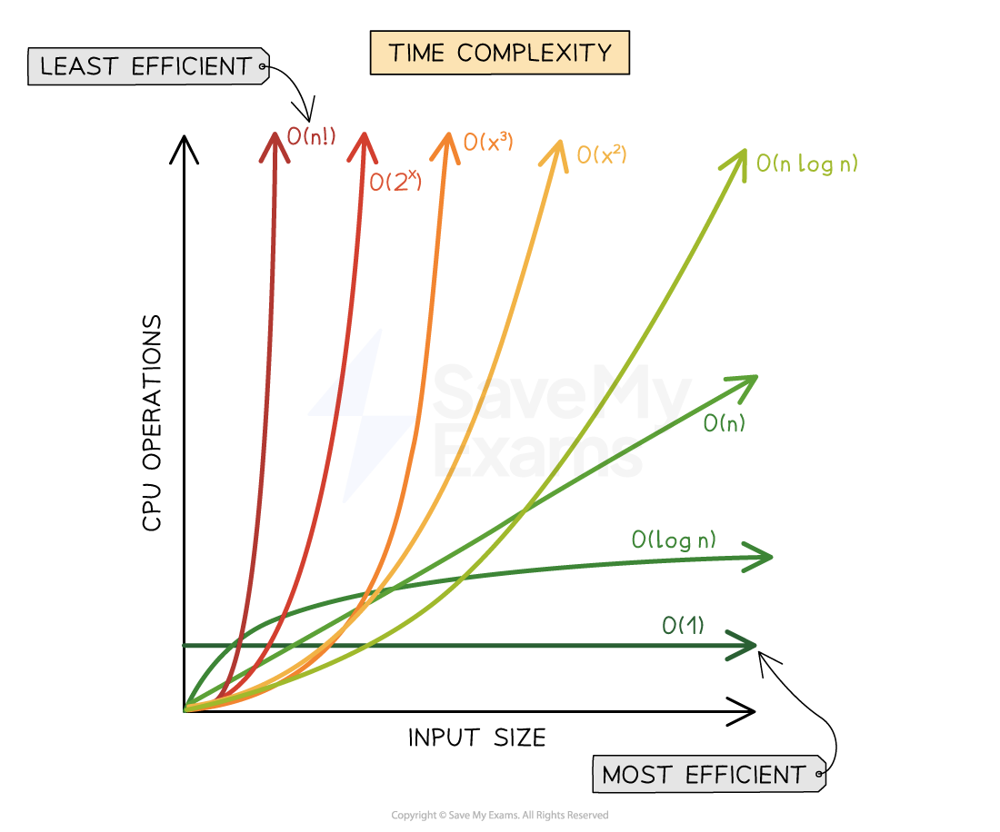

# Introduction to Data Structures and Algorithms.

**DSA (Data Structures and Algorithms)** is the study of organizing data efficiently using data structures like arrays, stacks, and trees, paired with step-by-step procedures (or algorithms) to solve problems effectively. Data structures manage how data is stored and accessed, while algorithms focus on processing this data.

### Why to Learn DSA?
    -   Learning DSA boosts your problem-solving abilities and make you a stronger programmer.
    -   DSA is foundation for almost every software like GPS, Search Engines, AI ChatBots, Gaming Apps, Databases, Web Applications, etc

### How to Learn DSA?

---

### Time Complexity

